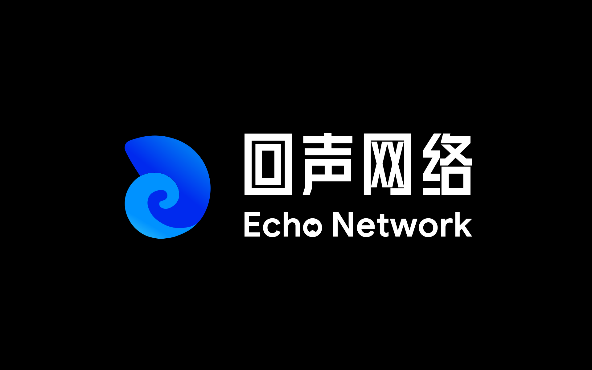
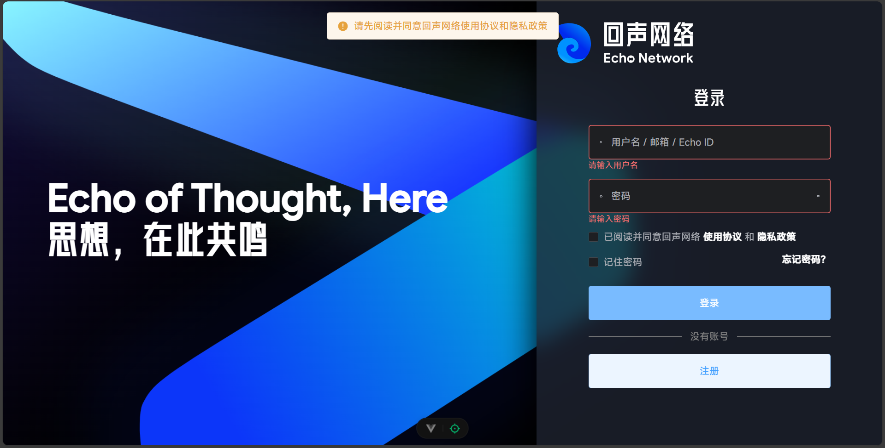
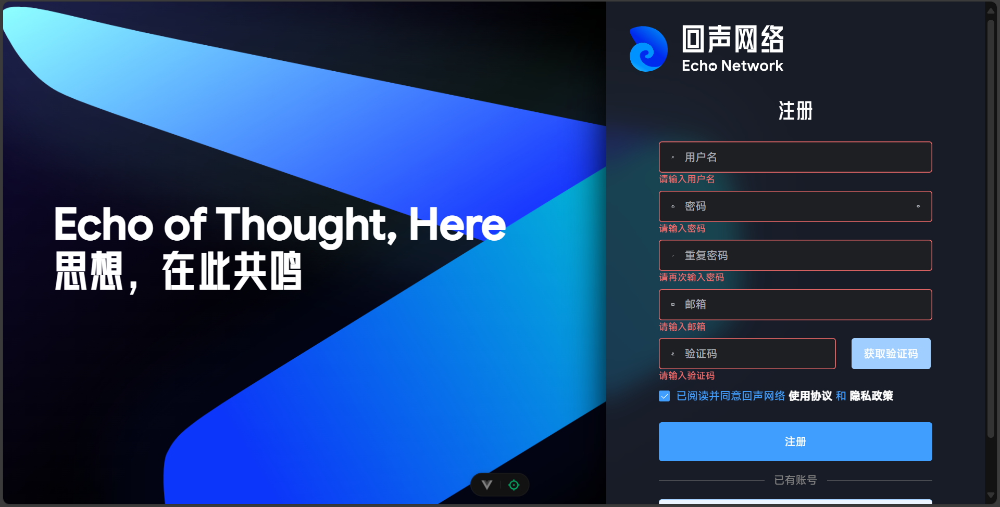
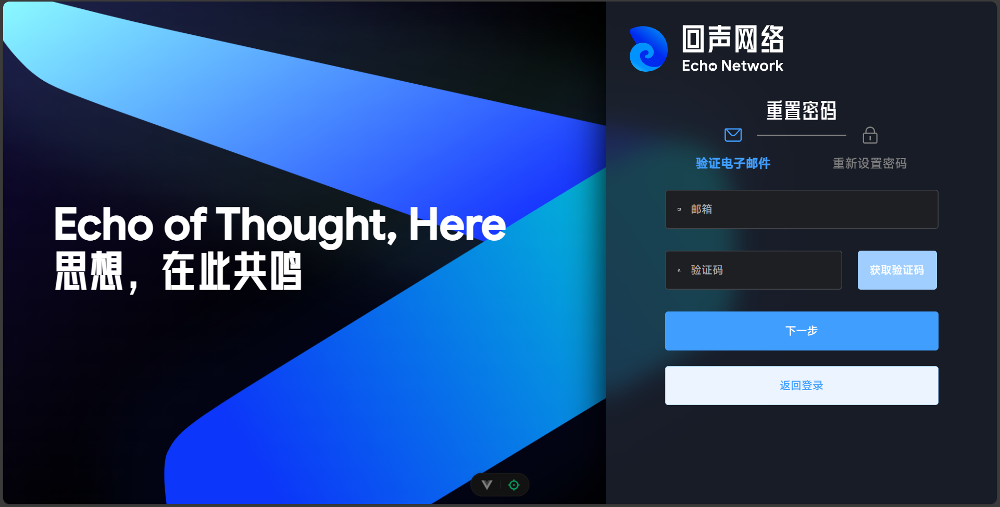
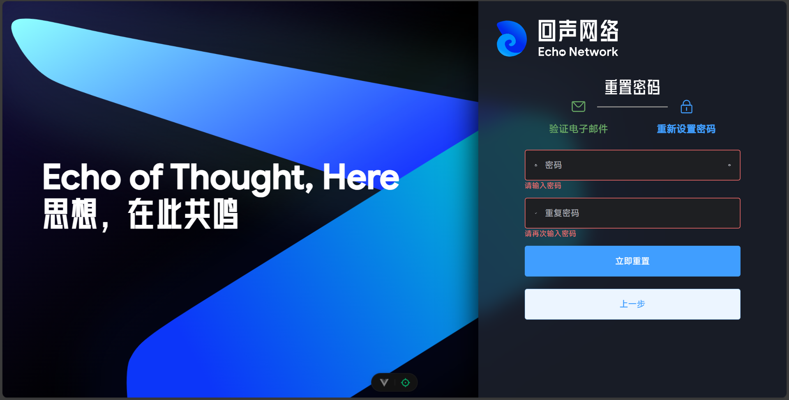
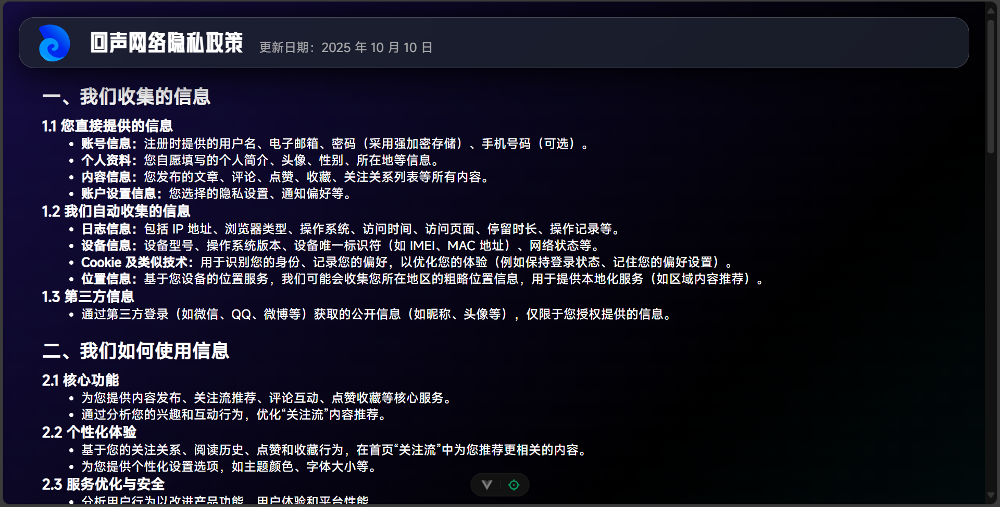
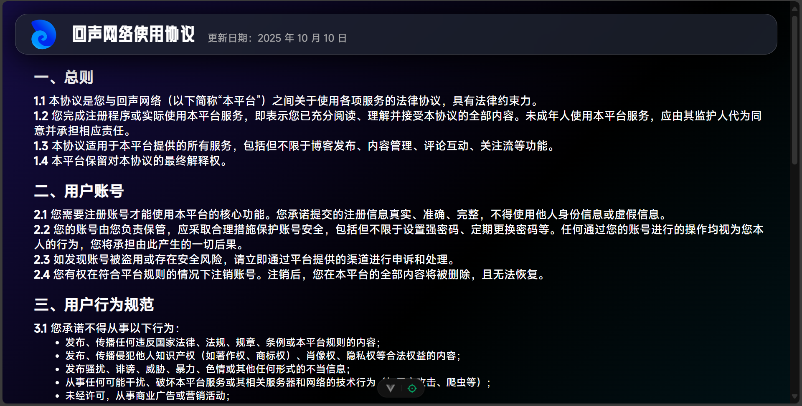

# 回声网络

## 项目介绍

“回声网络”是一个旨在复兴深度内容创作与交流的在线多人博客与内容管理系统。

### 技术选型

前后端分离开发模式

- 前端：Vue3 + Element Plus + Axios
- 后端：JDBC + MySQL + Servlet

# 开发日记

## 2025.10.4

### 设计图标

## 2025.10.9-2025.10.10

### 前端登录界面

### 前端注册界面

### 前端重置界面

### 前端隐私政策界面

### 前端使用协议界面

### 后端实体设计

- 用户 / 账号
- 文章
- 评论
- 标签
- 点赞
- 关注
- 请求结果
