# 开发日记

## 2025.10.25

- 后端功能
  - 发表评论
    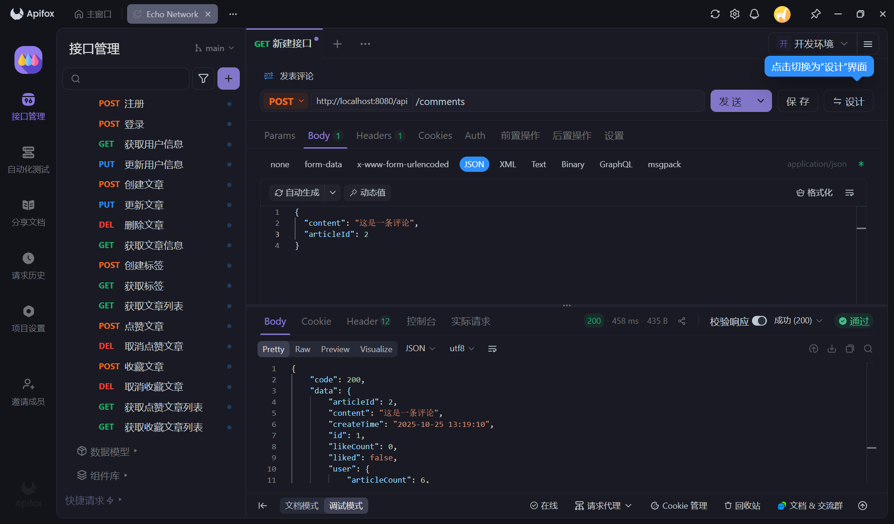
  - 获取文章评论列表
    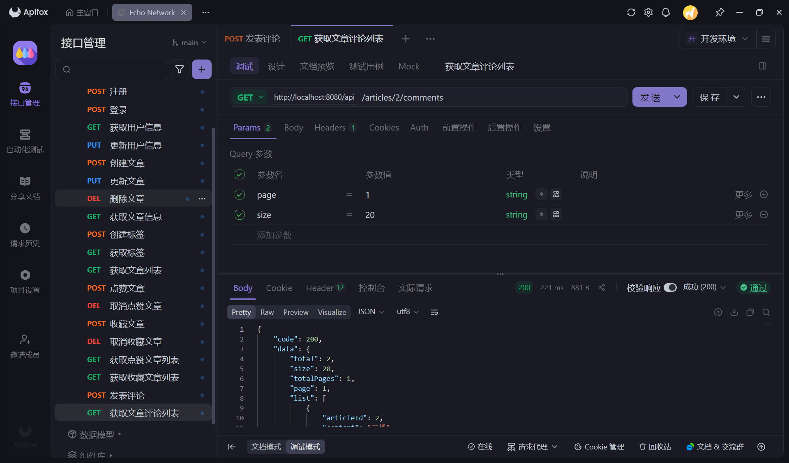
  - 删除评论
    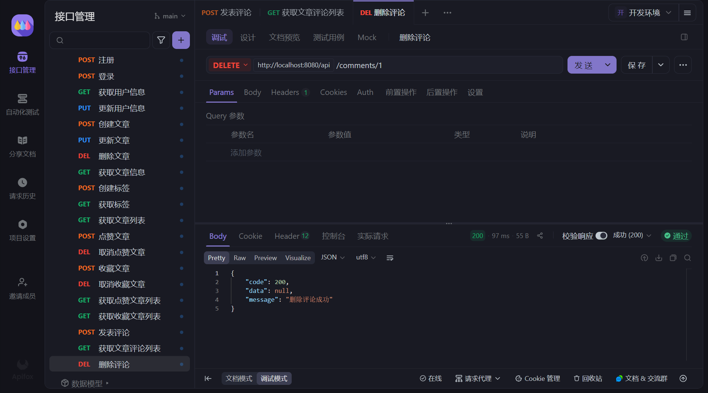
  - 点赞评论、取消点赞评论
    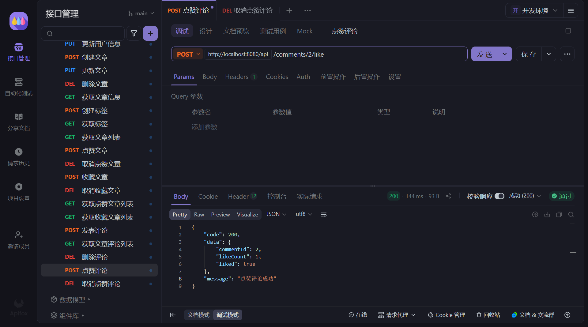
    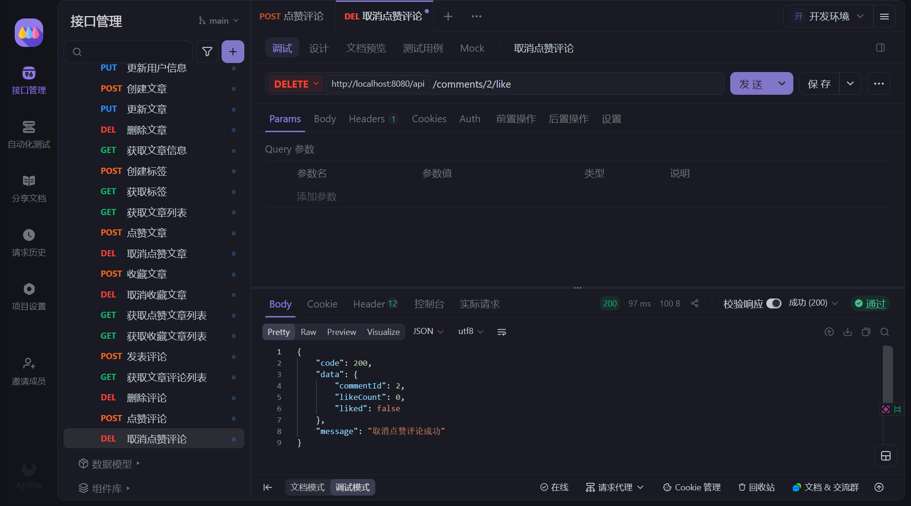

## 2025.10.24

- 前后端接口设计统一、优化（接口结构见 `接口设计` 文件）

- 后端功能
  
  - 获取文章信息
    
    
    
  - 更新文章
    
    
  - 删除文章
    
    
  - 创建标签
    
    
  - 获取、搜索标签
    
    
    
  - 获取文章列表（支持条件筛选、搜索、智能推荐等）
  
    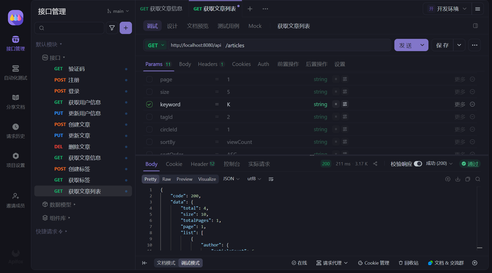
    
  
  - 点赞文章、取消点赞文章
    
    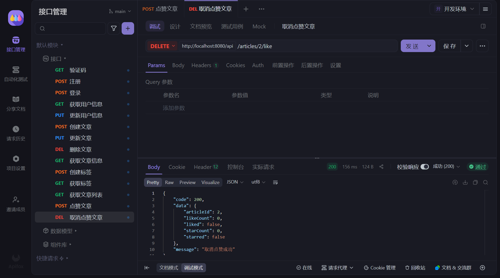
  
  - 收藏文章、取消收藏文章
    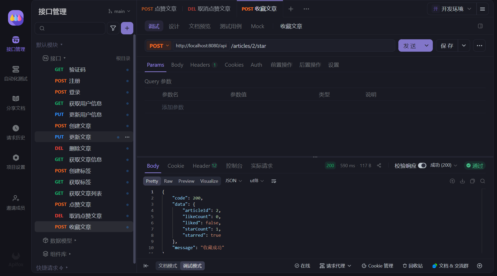
    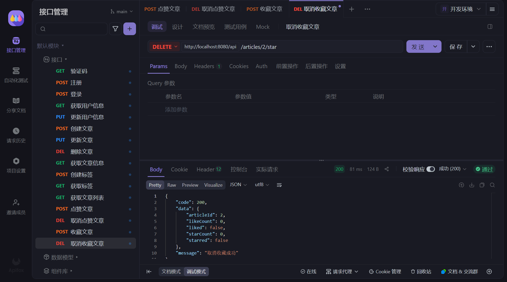
  
  - 获取点赞文章列表
    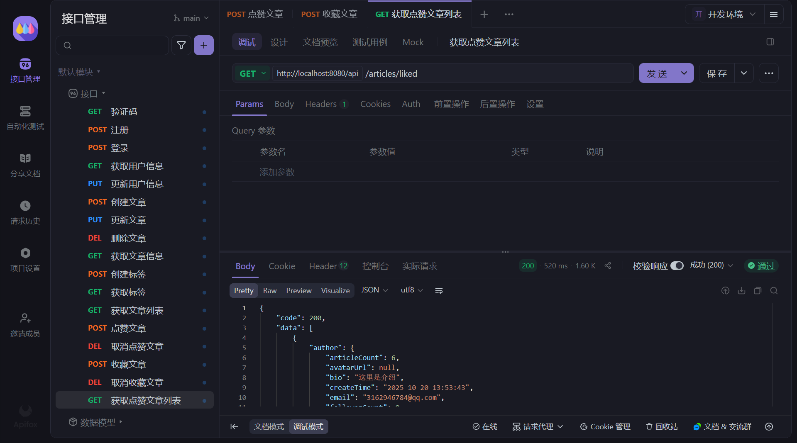
  
  - 获取收藏文章列表
    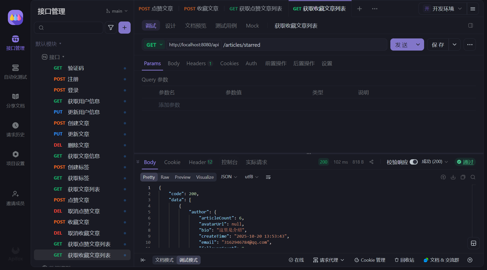

## 2025.10.23

- 后端功能
  - 获取用户信息
  - 更新用户信息
  - 创建文章
    

## 2025.10.22

- 前端文章编辑界面
  

## 2025.10.21

- 前后端联调
- 登出功能

## 2025.10.20

- 后端实体优化（转 Kotlin）
- 登录、注册功能

## 2025.10.19

- 验证码发送功能

## 2025.10.18

- 后端工具类封装
  - 数据库连接
  - 数据库操作
  - 密码加密

## 2025.10.17

- 真再鸽最后一天……

## 2025.10.16

- 再鸽最后一天……

## 2025.10.15

- 再鸽一天……

## 2025.10.14

- 先鸽一天……

## 2025.10.13

- 前端推荐界面
  
  - 星空设计
    
  - 支持骨架屏、无限加载
    
- 前端关于界面
  
  
  
  
  
  - 悬浮页脚卡片
    

## 2025.10.12

- 前后端接口初步设计（接口结构见 `接口设计` 文件）

## 2025.10.11

- 后端数据库最终优化设计（数据库结构见 `数据库设计` 文件）

## 2025.10.9-2025.10.10

- 前端登录界面
  
- 前端注册界面
  
- 前端重置界面
  
  
- 前端隐私政策界面
  
- 前端使用协议界面
  
- 后端数据库初步设计
  - 用户（账号）
  - 文章
  - 评论
  - 标签
  - 点赞
  - 关注
- 后端实体设计
  - 请求结果

## 2025.10.4

- 图标设计
  
  
